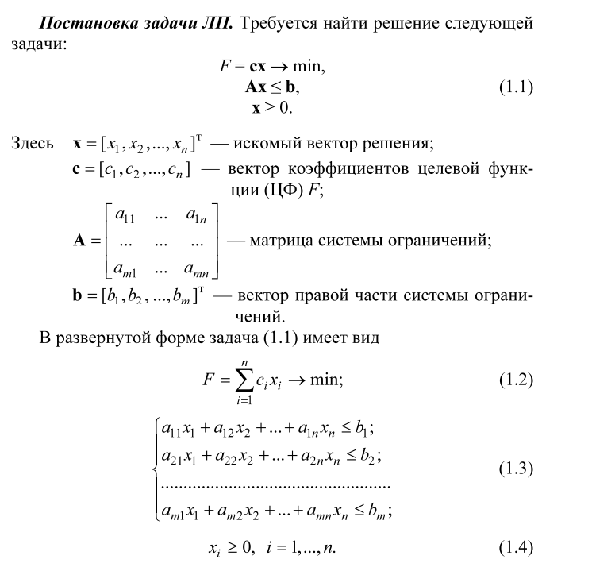

# parallel_simplex

Решение задачи линейного программирования при помощи параллельного варианта симплекс-метода

# Мат. постановка задачи линейного программирования (ЛП)



## GPU. CUDA

В качестве платформы для организации параллельных вычислений на GPU была выбрана CUDA (Compute Unified Device
Architecture).

Используемый программный пакет для Python: `cupy-cuda12x`.

### Параметры запуска

Видеокарта: GeForce GTX 1660

**System Management Interface SMI**

```bash
❯ nvidia-smi 
+-----------------------------------------------------------------------------------------+
| NVIDIA-SMI 550.120                Driver Version: 550.120        CUDA Version: 12.4     |
|-----------------------------------------+------------------------+----------------------+
| GPU  Name                 Persistence-M | Bus-Id          Disp.A | Volatile Uncorr. ECC |
| Fan  Temp   Perf          Pwr:Usage/Cap |           Memory-Usage | GPU-Util  Compute M. |
|                                         |                        |               MIG M. |
|=========================================+========================+======================|
|   0  NVIDIA GeForce GTX 1660        Off |   00000000:08:00.0  On |                  N/A |
|  0%   41C    P5             17W /  140W |     413MiB /   6144MiB |     29%      Default |
|                                         |                        |                  N/A |
+-----------------------------------------+------------------------+----------------------+
```

**CUDA Toolkit:**

```bash
❯ nvcc -V
nvcc: NVIDIA (R) Cuda compiler driver
Copyright (c) 2005-2024 NVIDIA Corporation
Built on Tue_Oct_29_23:50:19_PDT_2024
Cuda compilation tools, release 12.6, V12.6.85
Build cuda_12.6.r12.6/compiler.35059454_0
```
