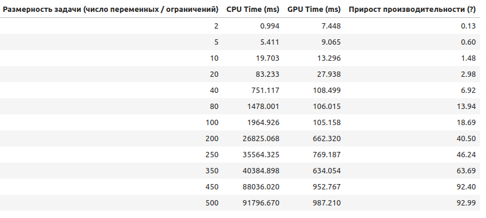
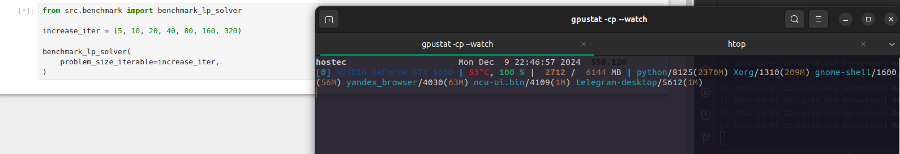
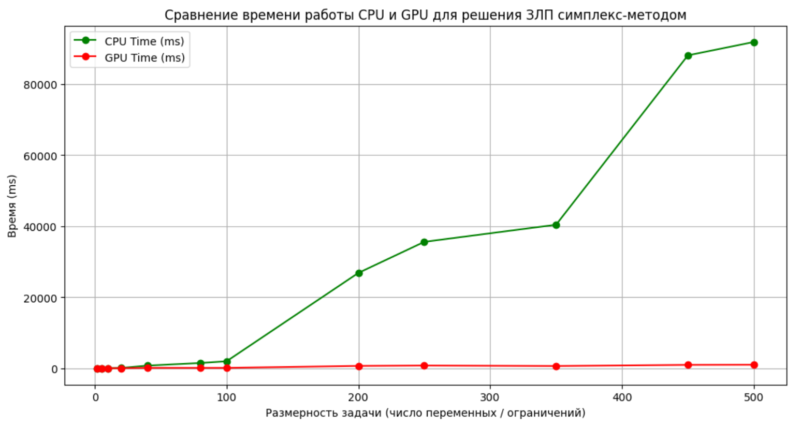
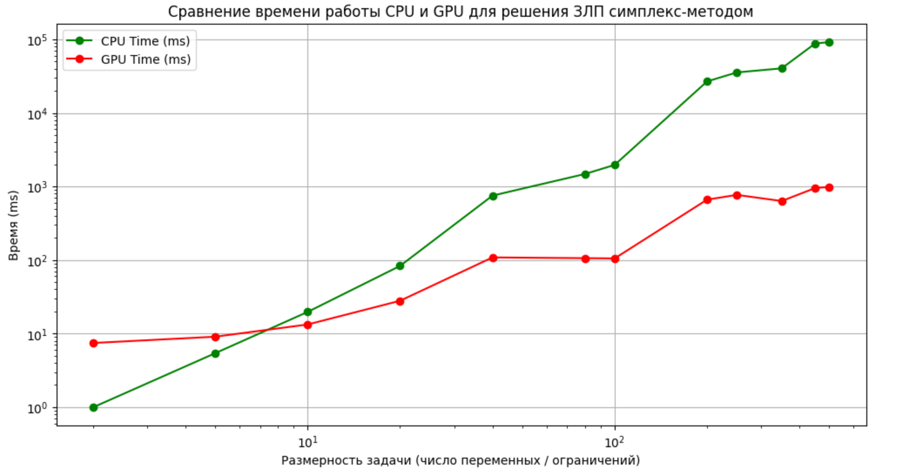

<h1 align="center"> Параллельные вычисления. ЗЛП симплекс-методом (GPU). 11 семестр  </h1>


<p align="center">
  <a href="https://camo.githubusercontent.com/0d0779a129f1dcf6c31613b701fe0646fd4e4d2ed2a7cbd61b27fd5514baa938/68747470733a2f2f696d672e736869656c64732e696f2f62616467652f707974686f6e2d3336373041303f7374796c653d666f722d7468652d6261646765266c6f676f3d707974686f6e266c6f676f436f6c6f723d666664643534">
      
  </a>
  <a href="https://camo.githubusercontent.com/6e8c75192accaac7b0084d407bdffad21e3b0368b32de2ab850d8da29fdfb881/68747470733a2f2f696d672e736869656c64732e696f2f62616467652f506f657472792d2532333342383246362e7376673f7374796c653d666f722d7468652d6261646765266c6f676f3d706f65747279266c6f676f436f6c6f723d304233443844">
      
  </a>
  <a href="https://camo.githubusercontent.com/0e0f1fb94d3602f6c88fc264493c7c72452fbe16df2f6ba0052ebf2fac6d0663/68747470733a2f2f696d672e736869656c64732e696f2f62616467652f6a7570797465722d2532334641304630302e7376673f7374796c653d666f722d7468652d6261646765266c6f676f3d6a757079746572266c6f676f436f6c6f723d7768697465">
      
  </a>
  <a href="https://camo.githubusercontent.com/201e0e586a865b19eef2e2d271662d9b4304757ff6710b7e4ccebf7b99fe7873/68747470733a2f2f696d672e736869656c64732e696f2f62616467652f6e756d70792d2532333031333234332e7376673f7374796c653d666f722d7468652d6261646765266c6f676f3d6e756d7079266c6f676f436f6c6f723d7768697465">
      
  </a>
  <a href="https://camo.githubusercontent.com/4efd7f1d3b197076346d6ecd1624efc192bd72de6f99ed1f7338c450907bb53f/68747470733a2f2f696d672e736869656c64732e696f2f62616467652f637564612d3030303030302e7376673f7374796c653d666f722d7468652d6261646765266c6f676f3d6e5649444941266c6f676f436f6c6f723d677265656e">
      
  </a>

Решение задачи линейного программирования при помощи параллельного варианта симплекс-метода
</p>

## Мат. постановка задачи линейного программирования (ЗЛП)



## Установка окружения и запуск

0. Установка драйверов NVidia и [CUDA Toolkit 12.4](https://developer.nvidia.cn/cuda-downloads?target_os=Linux&target_arch=x86_64&Distribution=Ubuntu&target_version=22.04&target_type=deb_network)

Инструкции по установке:
```bash
wget https://developer.download.nvidia.com/compute/cuda/repos/ubuntu2204/x86_64/cuda-keyring_1.1-1_all.deb
sudo dpkg -i cuda-keyring_1.1-1_all.deb
sudo apt-get update
sudo apt-get -y install cuda-toolkit-12-4
```

Устаревший модуль ядра:
```bash
sudo apt-get install -y cuda-drivers
```

Модуль ядра flavor:
```bash
sudo apt-get install -y nvidia-driver-550-open
sudo apt-get install -y cuda-drivers-550
```

1. Установка **Poetry** для управления зависимостями.

```bash
# Install Poetry.
pip3 install poetry==1.8.4
# Verify that Poetry is working.
poetry --version
```

> [!WARNING]
> If you receive an error: `Command not found.", add Poetry to your user Path variable`, то добавьте `poetry` в `PATH`:

```bash
# For *-nix systems.
export PATH="$HOME/.local/bin:$PATH"
```

```powershell
# For Windows.
[System.Environment]::SetEnvironmentVariable('path', $env:USERPROFILE + "\AppData\Roaming\Python\Scripts;" + [System.Environment]::GetEnvironmentVariable('path', "User"),"User")
```

2. Все зависимости уже Зафиксированы в `poetry.lock`, вам просто нужно их установить:

```bash
poetry install --without dev
```

3. И теперь всё готово для запуска Jupyter Notebook с помощью `env`, основанного на зависимостях `poetry venv`.

```bash
poetry run jupyter notebook
# OR just activate your created virtual environment like this.
poetry shell
```

### GPU. CUDA

В качестве платформы для организации параллельных вычислений на GPU была выбрана CUDA (Compute Unified Device
Architecture).

Используемый программный пакет для Python: `cupy-cuda12x`.

#### Параметры запуска

Видеокарта: GeForce GTX 1660

**System Management Interface SMI**

```bash
❯ nvidia-smi 
+-----------------------------------------------------------------------------------------+
| NVIDIA-SMI 550.120                Driver Version: 550.120        CUDA Version: 12.4     |
|-----------------------------------------+------------------------+----------------------+
| GPU  Name                 Persistence-M | Bus-Id          Disp.A | Volatile Uncorr. ECC |
| Fan  Temp   Perf          Pwr:Usage/Cap |           Memory-Usage | GPU-Util  Compute M. |
|                                         |                        |               MIG M. |
|=========================================+========================+======================|
|   0  NVIDIA GeForce GTX 1660        Off |   00000000:08:00.0  On |                  N/A |
|  0%   52C    P0             65W /  140W |    2775MiB /   6144MiB |    100%      Default |
|                                         |                        |                  N/A |
+-----------------------------------------+------------------------+----------------------+
                                                                                         
+-----------------------------------------------------------------------------------------+
| Processes:                                                                              |
|  GPU   GI   CI        PID   Type   Process name                              GPU Memory |
|        ID   ID                                                               Usage      |
|=========================================================================================|
|    0   N/A  N/A      1360      G   /usr/lib/xorg/Xorg                            176MiB |
|    0   N/A  N/A      1624      G   /usr/bin/gnome-shell                           40MiB |
|    0   N/A  N/A      9963      C   ...-simplex-Fa3Iw1Zs-py3.10/bin/python       2370MiB |
+-----------------------------------------------------------------------------------------+
```

**CUDA Toolkit:**

```bash
❯ nvcc -V
nvcc: NVIDIA (R) Cuda compiler driver
Copyright (c) 2005-2024 NVIDIA Corporation
Built on Tue_Oct_29_23:50:19_PDT_2024
Cuda compilation tools, release 12.6, V12.6.85
Build cuda_12.6.r12.6/compiler.35059454_0
```

## Результаты




Линейная шкала:


Логарифмическая шкала:

